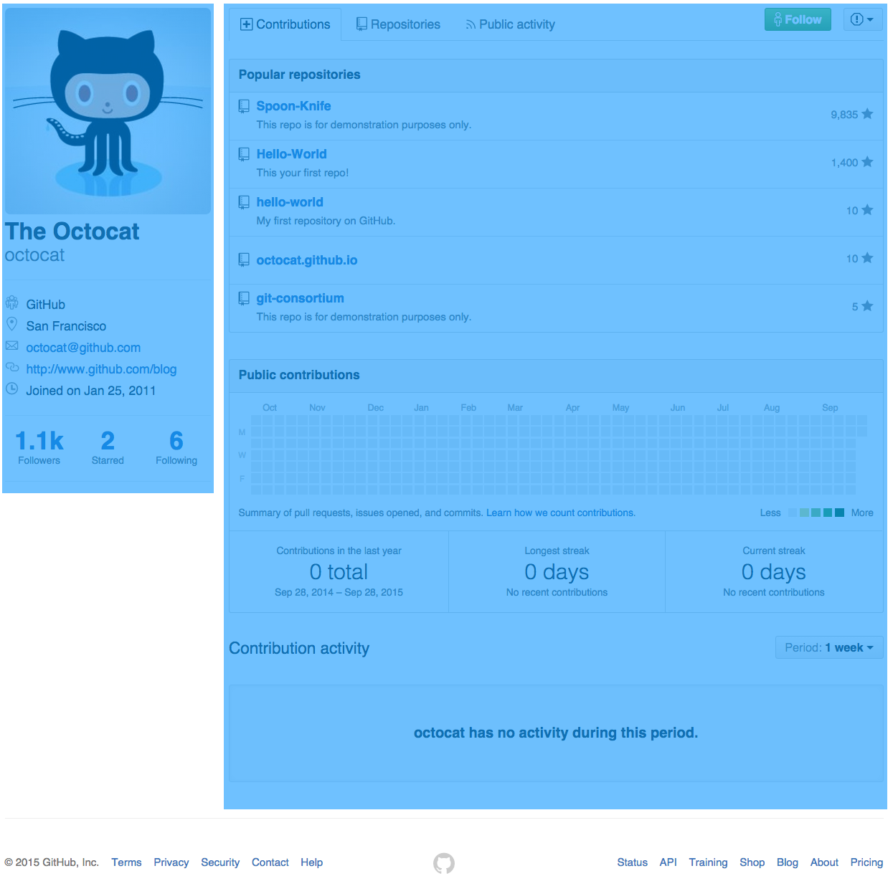

# 17 -- Beneath the Planet of the APIs

## Rituals (~1h 30m)

* **Standup Meeting** (~15m)
* **Homework Review** (~30m)
* **Quiz Time!** (~15m)
* **Three Little Things** (~30m)

## Tools on Tuesday

* Getting data with [`jQuery.ajax`](http://api.jquery.com/jQuery.ajax/)...
  * [What is a `Promise`](http://www.html5rocks.com/en/tutorials/es6/promises/)? (~15m)
    * What would cause that? When would I use that?
  * Let's get some data!
    * Where is that data? Time for some relative URLs!
    * Fetch it with `jQuery.ajax`
    * Now that we have the underpants...
    * But what if we need _more_ underpants, I mean... _data_?
* Don't shoot the [Postman](https://www.getpostman.com/)...
  * Didn't this data come from [the API](https://api.github.com/)?
  * What about [that `octocat` data](https://api.github.com/users/octocat)?
  * My God, [it's full of links...](https://en.wikipedia.org/wiki/HATEOAS)

## Assignment

```markdown
* **Yak-Shaving**
  * [ ] Create a _WIP Issue_ in the class repo
  * [ ] **MERGE ALL YOUR OPEN PRs!**
    * [ ] Specifically `TIY-GitHub:yak-shaving` into `master`!
  * [ ] Create a _WIP Branch_ in:
    * [ ] `TIY-Assignments` named `17--beneath-the-APIs` from `master`
    * [ ] `TIY-GitHub` named `release--0.0.1` from `master`
* [ ] Create or update the following _WIP Files_ in:
    * `USERNAME.GitHub.io:journal-week-4`
      * `journal-week-4.md` or something creative
      * `tutorial-week-4.md` or something creative
    * `TIY-Assignments:17--beneath-the-APIs`
      * `CheatSheets/GitHubAPI.md`
    * `TIY-GitHub:release--0.0.1`
      * `specs/octocat--details.png`
      * `src/`
        * `scss/custom.scss`
        * `js/main.js`
        * `index.html`
* [ ] Add comments to your _WIP Issue_ with links to your PRs in:
    * [ ] `USERNAME.GitHub.io` from `journal-week-4` into `master`
    * [ ] `TIY-Assignments` from `17--beneath-the-APIs` into `master`
    * `TIY-GitHub`
      * [ ] from `release--0.0.1` into `master`
      * [ ] from `feature--basic-layout` into `release--0.0.1` (MERGED)
      * [ ] from `feature--profile-details` into `release--0.0.1` (MERGED)
      * [ ] from `feature--fetching-data` into `release--0.0.1` (MERGED)
* **Journal, Week 4**
  * [ ] Outline for _reflective_!
  * [ ] Outline for _tutorial_!
  * [ ] Peer review x2!
  * [ ] Reviewed peers x2!
* **Reading APIs**
  * What are the endpoints for fetching...
    * the profile data for a user?
    * the organizations a user belongs to?
    * the repositories a user has created?
    * a filtered list of repositories?
    * a sorted list of repositories?
    * public events for a user?
  * When fetching public events for a user...
    * How many results are returned by default?
    * What limitations exist on fetching _more_ results?
    * What is the basic structure of the results?
    * What fields are included in each result?
    * What are the data types for each field?
    * What are some of the different values for the `type` field?
* **GitHub Revolution, Part 2**
  * [ ] `feature--basic-layout`
  * [ ] `feature--profile-details`
  * [ ] `feature--fetching-data`
```

### Journal, Week 4+

Last night you brainstormed topics. Now it's time to choose two -- one for your reflective entry and one for your tutorial. Outline both entries, then get them reviewed by your peers. Be sure to review theirs, too!

### Reading APIs: GitHub

Tonight, focus on the following questions about the GitHub API, which will be important as you build out your profile:

* What are the endpoints for fetching...
  * the profile data for a user?
  * the organizations a user belongs to?
  * the repositories a user has created?
  * a filtered list of repositories?
  * a sorted list of repositories?
  * public events for a user?
* When fetching public events for a user...
  * How many results are returned by default?
  * What limitations exist on fetching _more_ results?
  * What is the basic structure of the results?
  * What fields are included in each result?
  * What are the data types for each field?
  * What are some of the different values for the `type` field?


### GitHub Revolution, Part 2

Yaks shaved, Skitching complete, now to start making the HTML and (S)CSS for your profile template. For the purposes of this exercise, _omit the page header_ with the search field and primary navigation.

Start by creating a _new_ branch named `release--0.0.1` from `master` in your `TIY-GitHub` repository. All your work from tonight will be in _feature_ branches that stem from and merge back into this one, which represents your first, tiny, incremental release version: 0.0.1

#### Octocat in Blue

The profile page is generally laid out into two uneven columns that are centered on the page:



In a _new_ branch named `feature--basic-layout` based on `release--0.0.1`, start with some MF'g HTML and (S)CSS to get those _outermost_ layout elements correct: a set of two proportionate but uneven columns centered on the page. The contents are unimportant to begin with; just focus on the overall layout first, i.e. the blue rectangles.

Open a PR for this work _into the `release--0.0.1` branch_ and solicit peer review. Get 2x :+1: (and some commentary) before you merge it. Locally, check out `release--0.0.1` and `git pull` to update it.

#### Just the Facts, Cat... Octopus... Thing.

Next, focus on filling in the "details" column with information for Octocat. Create another new branch _based on `release--0.0.1` **after** the PR for `feature--basic-layout` is merged._ Now you're building "features": small, self-contained pieces of the overall functionality. Build the HTML and (S)CSS you'll need to represent _just the profile details for Octocat_ in the left-side column.


Isn't all of that information available from the API data you saved last night? You bet it is! Identify the fields in `octocat.json` that correspond to the source data for each area and document it in a Skitch note in `specs/` for now. We'll use those notes soon.

Just looking at this, you should probably have some questions, like:

* [Where could you possibly find all those icons?](https://octicons.github.com/)
* [How will you get those three blocks to line up like that?](https://css-tricks.com/dont-overthink-it-grids/)
* [How will you format that date so nicely?](https://momentjs.com)

Push this branch to GitHub and open a PR into `release--0.0.1` _as soon as you have a commit_, merge it when you're finished (enough) and have solicited a code review from two of your peers (that means they left you feedback _that you incorporated_ and gave you a :+1:). Then `git pull` the updates into your local `release--0.0.1` branch. What happens when you push _that_ branch up to GitHub? Don't you have a PR for that already?

#### Gimme the Dataz!

We might as well practice writing some jQuery while we're here. In _another_ feature branch -- `feature--fetch-data` -- use `jQuery.ajax` to fetch the data from your `octocat.json` file and log it to the `console`. That code should go inside the `main.js` file, [enclosed in an IIFE](https://en.wikipedia.org/wiki/Immediately-invoked_function_expression).

Like before, push this feature branch to GitHub and open a PR _into the `release--0.0.1` branch._ When your PR is reviewed, merge it.

#### BEAST MODE

There's a correlation between the data in `octocat.json` and the values in the left column, correct? Can you select each element that corresponds to a data field and replace its contents with the correct value from the JSON file?
