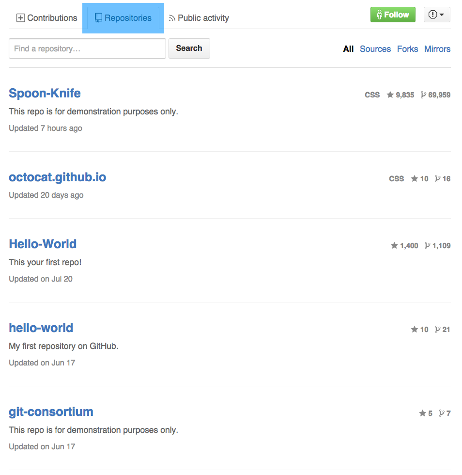
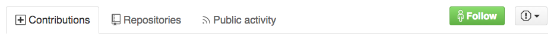

# 20 -- Escape From the Planet of the APIs

## Rituals (~1h 30m)

* **Standup Meeting** (~15m)
* **Homework Review** (~30m)
* **Retrospective** (~15m)
* **Parking Lot Topics** (~15m)

## Parking Lot Review

## Agenda

* The Chessboard is Dead, Long Live Chess
* Vive la GitHub Revolution!

## Assignment

```markdown
* **Yak-Shaving**
  * [ ] Create a _WIP Issue_ with links to:
    * your PR in `USERNAME.github.io`
      * [ ] from `journal-week-5` into `master`
      * [ ] from `release--0.0.0` into `master`
    * [ ] your PR in `TIY-GitHub` from `release--0.0.2` into `master`
    * [ ] your PRs in `TIY-GitHub` from `feature--*` (multiple) into `release--0.0.2`
  * [ ] **MERGE YOUR OPEN PRs!**
    * [ ] in `USERNAME.github.io` from `journal-week-4` into `master`
    * [ ] in `TIY-Chessboard`
    * [ ] in `TIY-GitHub` (from last week)
  * [ ] Create the following _WIP Branch_ in:
    * `USERNAME.github.io`
      * [ ] named `journal-week-5` from `master`
      * [ ] named `release--0.0.0` from `master`
    * `TIY-GitHub`
      * [ ] named `release--0.0.2` from `master`
      * [ ] named `feature--profile-placeholders` from `release--0.0.2`
      * [ ] named `feature--FILL_ME_IN` from `release--0.0.2`
  * [ ] Create or update the following _WIP Files_ in:
    * `USERNAME.github.io:journal-week-5`
      * `journal-week-5.md` or something creative
      * `tutorial-week-5.md` or something creative
      * `resource-week-5.md` or something creative
    * `USERNAME.github.io:release--0.0.0`
      * `.gitignore` -- with the following patterns:
        * `/dist`
        * `/node_modules`
        * `/bower_components`
        * `css`
      * `package.json` -- and `npm install --link --save-dev`
        * `bower`
        * `browser-sync`
        * `gulp`
        * `node-sass`
      * `specs/` -- for **BEAST MODE**
      * `src/` -- from `yo h5bp`
        * `js/`
          * `main.js`
          * nothing else!
        * `scss/`
          * `_common.scss`
          * `_desktop.scss`
          * `_mobile.scss`
          * `_tablet.scss`
          * `main.scss` -- with `@import` links to above
        * `css/` -- DELETED!
        * `index.html`
    * `TIY-GitHub:release--0.0.2`
      * `apis/github/users/`
        * `USERNAME.json` -- for _your_ profile data
        * `USERNAME/`
          * `repos.json` -- for _your_ repository data
          * `activity.json` -- for _your_ public events
      * `src/`
        * `scss/_custom.scss` -- to clean up your (S)CSS
        * `js/main.js` -- in case you need to catch up on `jQuery.ajax`
        * `index.html`
* **Journal, Week 5**
  * [ ] Resource Journal _Draft_
  * [ ] Reflective Journal _Outline_
  * [ ] Tutorial _Outline_
* **Reading APIs**
  * [ ] All caught up!
* **GitHub Revolution** -- Now with MORE CHECKBOXES!
  * [ ] `feature--my-little-profile`
    * [ ] `USERNAME.json`
    * [ ] `USERNAME/repos.json`
    * [ ] `USERNAME/activity.json`
  * [ ] `feature--profile-placeholders`
    * [ ] Please state your `name`...
    * [ ] Would you like to `login`?
    * [ ] Octocat is a `company` man, er... monster.
    * [ ] Last known `location`?
    * [ ] You've got `email`!
    * [ ] Don't forget the missing `link`...!
    * [ ] Wait, gimme a `moment` to figure this out...
  * [ ] `feature--main-column-tabs`
    * [ ] Seems like this is `<nav>`-igation...
    * [ ] Don't just _use_ the Octicons, _become_ the Octicons...
    * [ ] Is that _really_ a `<button>`?
    * [ ] To start, just _make_ one `.active`...
    * [ ] Don't settle for less than interactive!
    * [ ] Every `.tabs` needs `.panels`...
  * [ ] `feature--repo-list-layout`
    * [ ] If I _wanted_ to `Search`...
    * [ ] ...or filter!
    * [ ] This cat sure likes nursery rhymes...
    * [ ] ...about CSS, apparently.
    * [ ] Stars and forks forever!
    * [ ] How does he/she/it find time for these updates?
    * [ ] Don't tell me you forgot all the links!
    * [ ] And the World says "Hello" to you, too!
    * [ ] 3 Examples is enough to derive a pattern from...
  * **BEAST MODE** `feature--repo-list-placeholders`
    * What do "Spoon-Knife" and "Hello-World" have in common?
    * Don't tell me you forgot the links again!
    * That `description` is not very descriptive...
    * She said we don't speak the same `language`.
    * What do you call a vampire who practice astrology? `stargazer_count`
    * It's like ten thousand `forks` when all you need is a `"Spoon-Knife"`
```

### Journal, Week 5

Welcome to Week 6!

In addition to your reflective journal entry and your tutorial journal entry this week, also share a bookmarked URL to a tool or article. That sounds easy, doesn't it? But wait, there's more... Write a paragraph _explaining_ the resource you're linking to and why it was helpful. Give us the [**tl;dr**](https://en.wikipedia.org/wiki/TL;DR) on that article or just the important parts of the documentation: installation, usage, why it exists. Keep it simple.

### Reading APIs

Did you finish all of your questions and terms last week? No? Finish them tonight!

### Getting Ready for the Week

We're going to use some cool new tools this week, which means **yak-shaving** today.

First, you'll want to _globally_ install [Bower](http://bower.io/) and [Gulp](http://gulpjs.com/). Hmmm, how do you globally install? Here's a hint: `npm install -g`...

##### BEAST MODE


### GitHub Revolution, Part 3: Octocat's Revenge

_For the love of everything holy, please **MERGE YOUR PRs FROM LAST WEEK**_ if you haven't done so already. While you're at it, also `git checkout` your `master` branch and `git pull` that sucker to get your previous work merged locally. Feel free to delete all those remotely merged branches, too.

For tonight, start by creating a _new_ branch named `release--0.0.2` from `master` in your `TIY-GitHub` repository. Like last week's GitHub Revolution, all of your work will be on _feature_ branches named with the `feature--` prefix. Be sure to link _each_ of your PRs that merge your feature branches into `release--0.0.2` _and_ your PR from `release-0.0.2` into `master`.

#### :musical_note: **WHO... ARE YOU?** :musical_note:

Now it's time to fetch your _own_ data. We'll need it later. Don't just slurp it down, though, check it out. Make sure it's correct... well, _looks_ correct.

First, save the JSON data from the GitHub API for your own username. Remember where that is? Make sure you get the list of repositories that belong to you, too. Finally, get your most recent _public activity_. You might have to do a little hunting. Too bad it's not all linked from your profile data...

Give [Postman](https://getpostman.com) a shot this time around and explore a little. What other data can you get out of the API for yourself? Even unauthenticated? Save your data to files in `apis/github/users/`, just like we did for Octocat.

Commit your JSON files into a branch named `feature--my-little-profile` and open a PR into `release--0.0.2` for review, merge when you get 2x :+1:s.

#### Twirl Your Moustache...

Time for the basics of [templates](https://en.wikipedia.org/wiki/Template_processor). Go back to the HTML for the profile column you finished last week. Start by replacing _one_ of your list items with mustachioed placeholders (`{{key_name}}`) that match the key in the API data that the value represents. For example, the text `The Octocat` comes from the `name` key in `octocat.json`, so replace that text with `{{name}}`.

_Put this work in the `feature--profile-placeholders` branch_ and open a PR into `release--0.0.2`, just like we did last time.

##### BEAST MODE

As you can imagine, we're going to use jQuery to replace those placeholders with the _actual_ values from the JSON data, but can you figure out _how?_ First you need to learn (or review) how to replace the contents of a tag with both the DOM and jQuery APIs. Second, how can you _select_ the appropriate tags to update? Finally, how could you update _the same HTML a second time_ with data from your _own_ profile?

#### Turn the Page... Well, at least finish it up.

Last week, we wrote the HTML and (S)CSS to get the _outermost_ layout elements and the left column. It's time for your next "feature": the larger section on the right, which is broken up into three sub-sections controlled by [a Tabbed Document Interface (TDI) or "tabbed panels"](https://en.wikipedia.org/wiki/Tab_(GUI)). We'll focus on the "Repositories" panel tonight:



##### Put it on my tab(s)...

For your _first_ feature, focus on the tabs that appear at the top of the right column:



Don't neglect the button-like (hint!) interfaces to the right _or_ forget to write jQuery / JavaScript to make the `.active` (suggestion!) tab the last one clicked. Start with three _inactive_ tabs, though. Write enough JavaScript to make "Repositories" _always_ active. Then make them update _just the tabs_... somehow. With jQuery magic.

_Please do **NOT** use [jQuery UI](http://ui.jquery.com) for these tabs._ Discovering how the magic works is what this assignment is all about.

Create another new branch based on `release--0.0.2` called `feature--main-column-tabs`. Push that to GitHub as soon as you're able and open a PR into `release--0.0.2` again. Get feedback _often_ and adjust your work accordingly until you get 2x :+1:s, then merge your work.

##### Who wants to look at an empty list?

Now we're ready to build out the "Repositories" section: the part of the page that corresponds to the "Repositories" tab. Hmm, wonder what would make a good connection between those two...? Any semantic tags coming to mind? What could we use that would work, even if we had CSS turned off? That's right, start with MF'g HTML that _just works_.

Then, look at the Skitches you placed in your `specs/` folder for that section of the page. Since it's pretty obvious that we're going to replace all of this with some kind of jQuery magic, just build out _three (3)_ examples of Octocat's repositories: "Spoon-Knife", "Hello-World" and "octocat.github.io".

Like before, push this branch to GitHub and open a PR into `release--0.0.2` as soon as you have a commit. Merge it when you're finished (enough) and have gotten solid code reviews. Then `git pull` the updates into your local `release--0.0.2` branch.

##### BEAST MODE

You could probably guess this step, but we'll walk through it anyway. Create a new branch from `release--0.0.2` named `feature--repo-list-placeholders` for your work. Start replacing the data in one of your example repos with mustachioed placeholders that correspond to the keys in the API data for a _single_ repository. We'll figure out the rest together.
